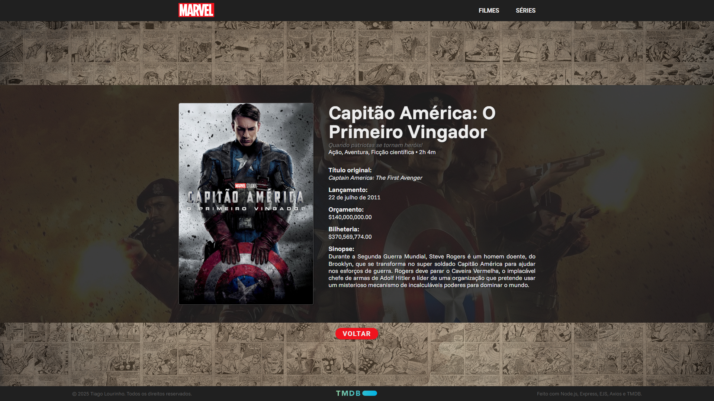
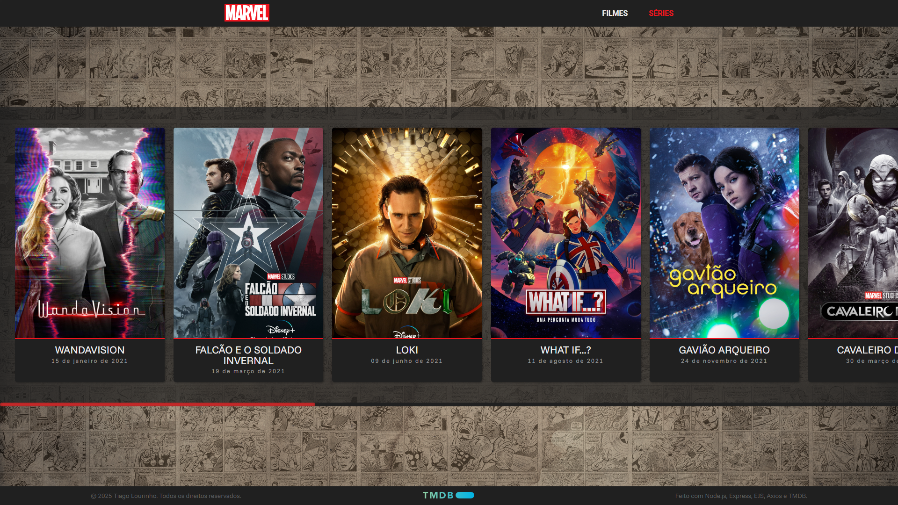
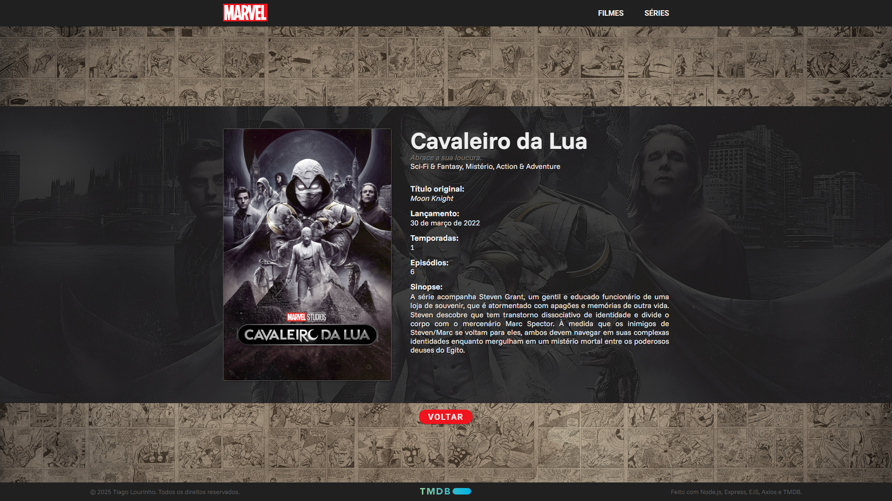

<p align="center">
  
</p>

<p align="center">
 <a href="#funcionalidades">Funcionalidades</a> •
 <a href="#demonstração">Demonstração</a> • 
 <a href="#como-executar">Como executar</a> • 
 <a href="#tecnologias">Tecnologias</a> • 
 <a href="#autoria">Autoria</a>
</p><br>

# MCU Cronologia

O projeto tem como objetivo apresentar aos usuários a linha do tempo completa do Universo Cinematográfico da Marvel (MCU), organizando de forma clara e acessível a ordem cronológica de seus filmes e séries. A plataforma é dividida em duas seções principais: uma dedicada aos filmes e outra às séries, permitindo a navegação por todo o catálogo disponível. Além disso, cada título conta com uma página individual onde é possível visualizar informações detalhadas, como sinopse, data de lançamento, bilheteria e outros dados relevantes, proporcionando uma experiência mais rica para os fãs do MCU.

## Funcionalidades

- Visualizar a lista de todo o catálogo de filmes e séries;
- Visualizar os detalhes de um filme ou série em específico;

## Demonstração

<p align="center">
  
  <em>Home</em>
</p>

<p align="center">
  
  <em>Lista de Filmes</em>
</p>

<p align="center">
  
  <em>Detalhes de um Filme</em>
</p>

<p align="center">
  
  <em>Lista de Séries</em>
</p>

<p align="center">
  
  <em>Detalhes de uma Série</em>
</p>

## Como executar

```Bash
# Clone este repositório
$ https://github.com/TiLourinho/mcu-cronologia

# Instale as dependências
$ npm install

# Inicie o servidor
$ npm start
```

O projeto estará rodando no endereço http://localhost:3000

## Tecnologias

- [Node.js](https://nodejs.org/pt)
- [Express](https://expressjs.com/pt-br/)
- [EJS](https://ejs.co/)
- [Axios](https://axios-http.com/)
- [TMDB](https://www.themoviedb.org/)

## Autoria

Tiago Lourinho

[](mailto:lourinho.tiago@gmail.com)
